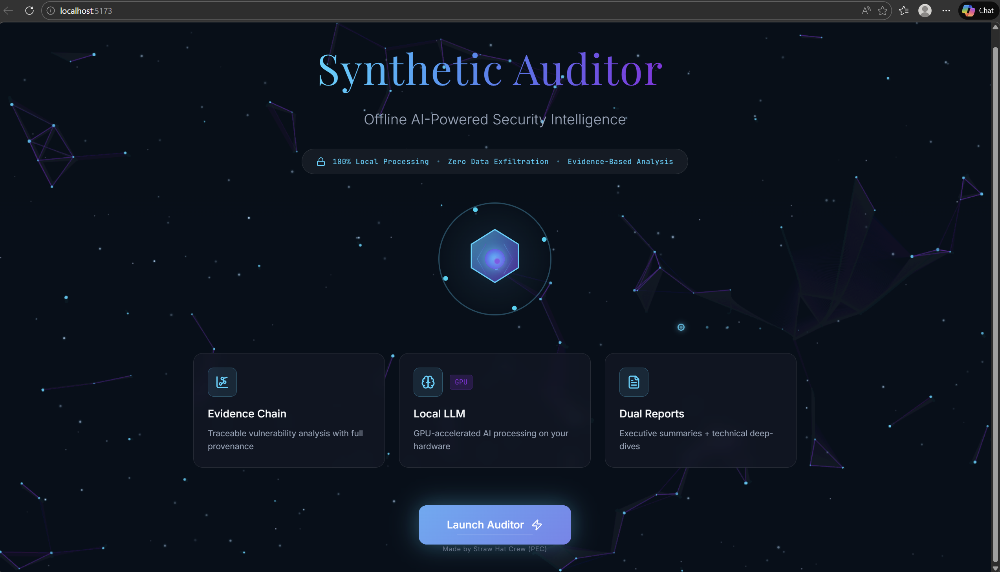
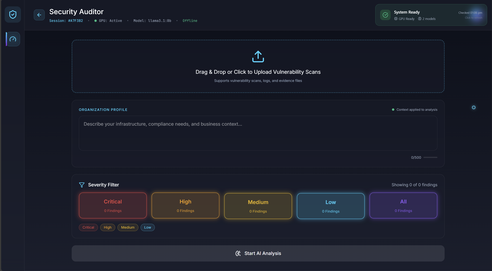
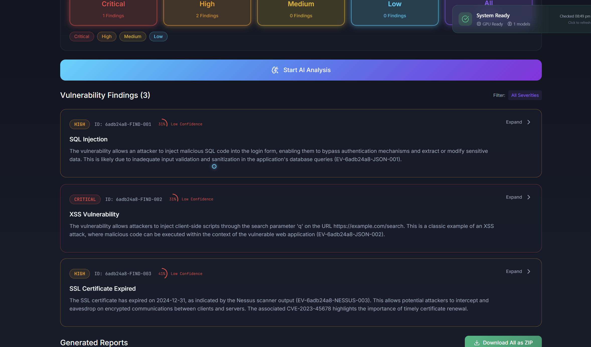
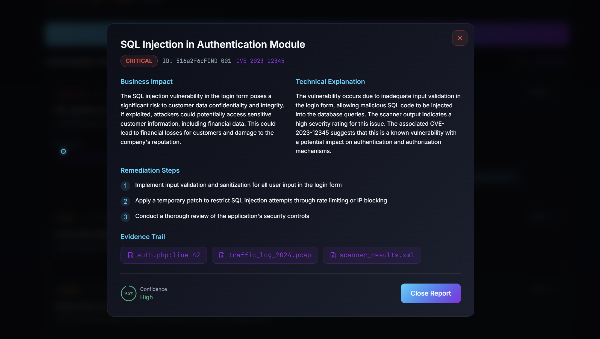
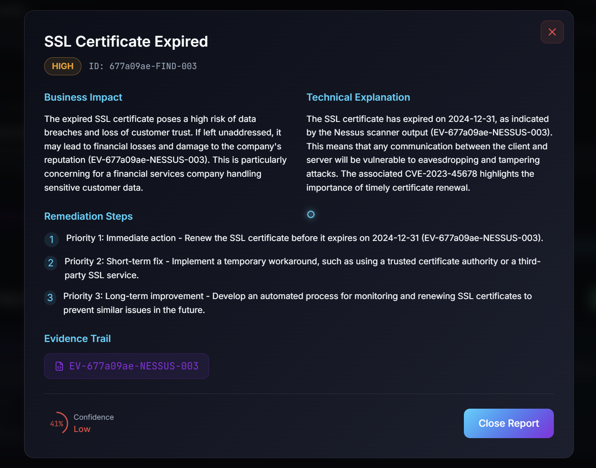
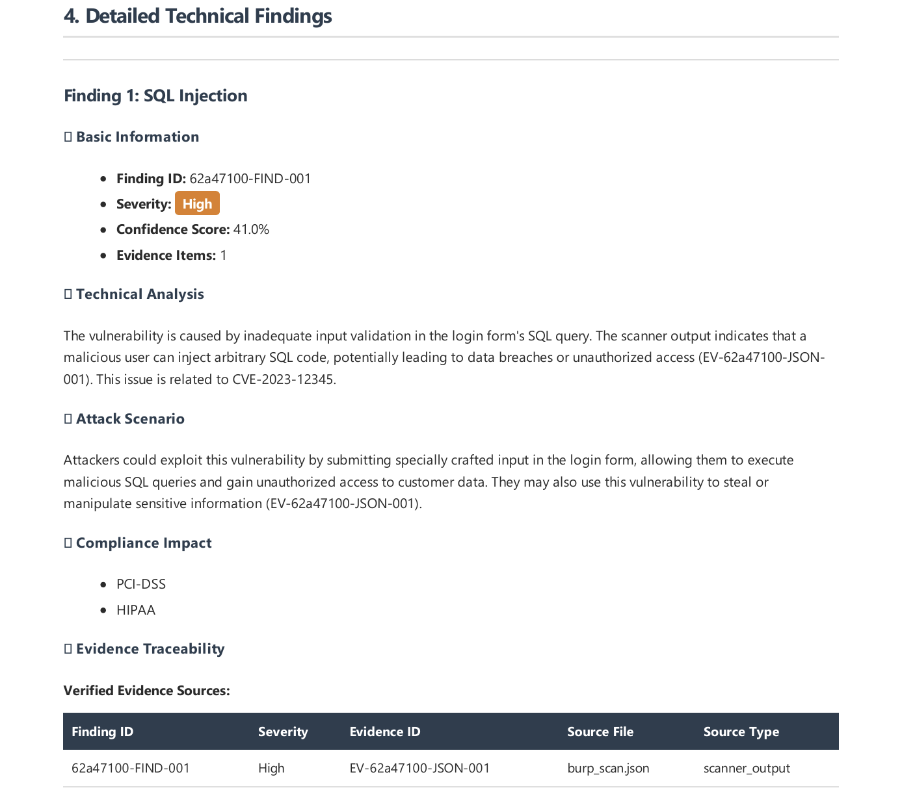
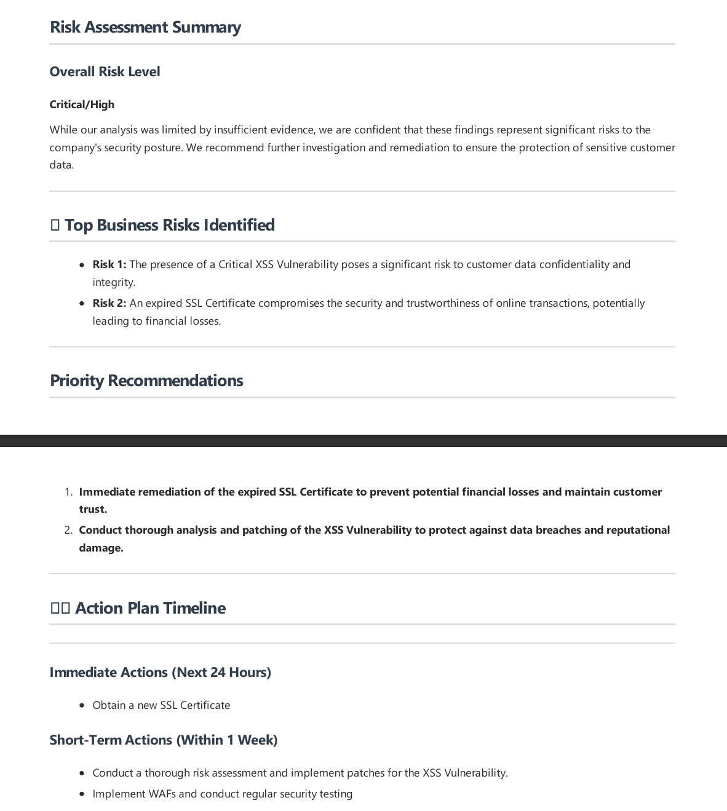
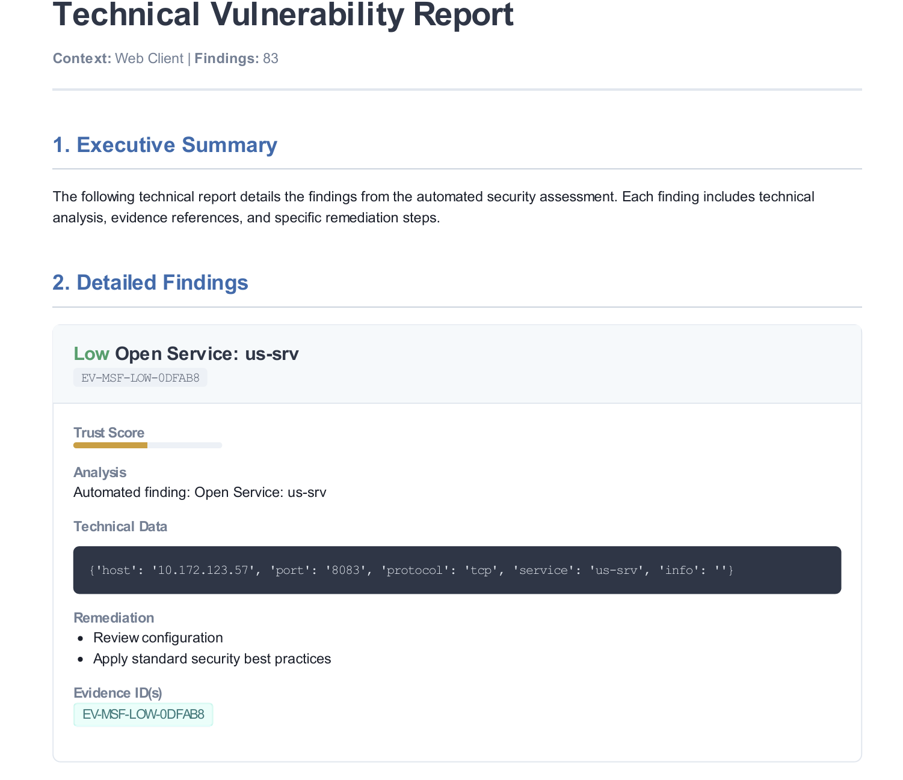
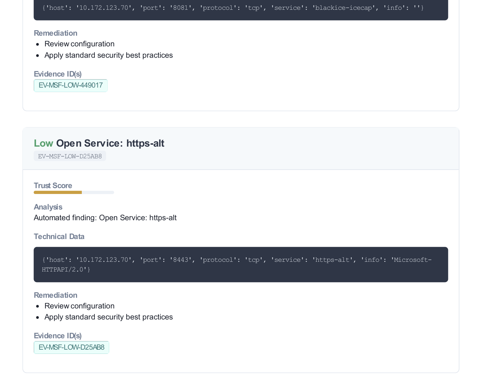
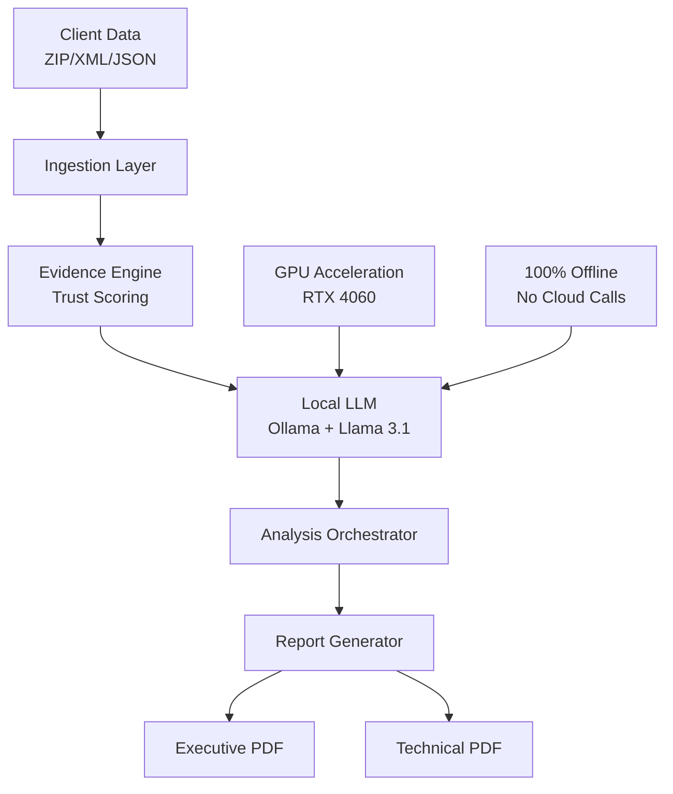

#  Synthetic Auditor: Offline AI-Powered Security Intelligence

<div align="center">
  


[Demo](#-demo) • [Key Features](#-key-features) • [Architecture](#-architecture) • [User Guide](#-user-guide) • [Contributors](#-contributors)

**Enterprise-grade vulnerability analysis with 100% data sovereignty. Transform raw security scans into executive and technical-ready reports using local AI—no cloud, no data exfiltration, complete privacy.**

</div>

## 🎯 Why Synthetic Auditor?

In an era of increasing data breaches and regulatory scrutiny, security consultants face a critical dilemma: **how to leverage AI for vulnerability analysis without compromising client data privacy?**

### 🚫 The Problem
- ❌ Cloud AI services expose sensitive client data
- ❌ Manual report writing takes hours per engagement  
- ❌ Inconsistent vulnerability explanations across teams
- ❌ No evidence traceability in AI-generated findings

### ✅ Our Solution
- ✅ **100% Offline Processing** - All AI analysis happens locally
- ✅ **Evidence Chain Verification** - Every claim references source data
- ✅ **Dual-Perspective Reports** - Executive & Technical views from single analysis
- ✅ **Trust Scoring System** - Confidence metrics for AI findings
- ✅ **GPU-Optimized** - RTX 4060 delivers 10-15s per finding

---
## 📊 Demo

> Below are real screenshots from the running **Synthetic Auditor** system — fully offline.

### 🏠 Landing Page


---

### 📤 Upload Vulnerability Scans
Supports ZIP, Nessus XML, Burp JSON, PCAP, logs, and CSV.



---

### 📋 Vulnerability Findings Dashboard
Severity-based grouping with AI confidence scores.



---

### 🔍 Detailed Finding – SQL Injection
Business impact, technical analysis, and remediation.



---

### 🔐 Detailed Finding – SSL Certificate Expiry
Risk prioritization with actionable remediation steps.



---

### 🔗 Evidence Traceability
Every AI claim is backed by verifiable evidence.



---

### 📄 Executive Report (Business View)
High-level risk summary for leadership.



---

### 🧪 Technical Report (Security Team View)
Deep technical breakdown with compliance mapping.

<p align="center">
  
  
</p>

---

## ✨ Key Features

### 🛡️ **Security-First Architecture**
- **Zero Data Exfiltration**: All processing occurs on your hardware
- **Air-Gap Compatible**: Deploy on isolated networks
- **Session Encryption**: Secure session storage with auto-expiry
- **Compliance Ready**: Built for PCI-DSS, HIPAA, GDPR environments

### 🧠 **Intelligent Analysis**
- **Local LLM Integration**: Ollama + Llama 3.1 8B (GPU accelerated)
- **Context-Aware Risk Assessment**: Tailors analysis to specific business contexts
- **Pattern Recognition**: Identifies vulnerability patterns across multiple files
- **Evidence Traceability**: Links every AI claim to source evidence IDs

### 📊 **Professional Reporting**
- **Executive Reports**: Business-focused PDFs for leadership
- **Technical Reports**: Detailed PDFs for security teams
- **Trust Scoring**: Confidence levels (85%+ = High confidence)
- **Remediation Roadmaps**: Prioritized action plans with timelines

### 🔧 **Enterprise-Grade Tooling**
- **Multi-Format Support**: ZIP, XML (Nessus), JSON (Burp), TXT, LOG, CSV, PCAP
- **Real-Time Pipeline**: 4-step processing visualization
- **Session Persistence**: Survives browser refresh (24h expiry)
- **REST API**: Full programmatic access to all features

---

## 🏗️ Architecture
---



**Core Components:**
- **Backend**: FastAPI + Python + PyTorch (CUDA enabled)
- **Frontend**: React + TypeScript + shadcn/ui + Tailwind
- **AI Engine**: Ollama + Llama 3.1 8B
- **PDF Generation**: wkhtmltopdf + custom templates
- **Session Storage**: JSON-based with encryption

---

## 🚀 Quick Start

### Prerequisites
- **Hardware**: NVIDIA GPU (RTX 4060+ recommended) or 16GB+ RAM for CPU mode
- **OS**: Windows 10/11, macOS 12+, or Ubuntu 20.04+
- **Software**: Python 3.11+, Node.js 18+, Docker (optional)

### Installation (5 Minutes)

#### Option 1: Docker (Recommended)
```bash
# Clone repository
git clone https://github.com/Vigneshwaran-NM/synthetic-auditor.git
cd synthetic-auditor

# One-command deployment
chmod +x deploy.sh
./deploy.sh
```

#### Option 2: Manual Setup
```bash
# 1. Backend Setup
cd backend
python -m venv venv
source venv/bin/activate  # Windows: venv\Scripts\activate
pip install -r requirements.txt
ollama pull llama3.1:8b

# 2. Frontend Setup
cd ../frontend
npm install
npm run dev

# 3. Start Backend (new terminal)
cd backend
python cli.py api
```

**Access the application:**
- Frontend: http://localhost:5173
- API Docs: http://localhost:8000/docs
- Health Check: http://localhost:8000/api/v1/health

---

## 📖 User Guide

### 1. Upload Security Scans
- **Supported Formats**: `.zip`, `.xml` (Nessus), `.json` (Burp), `.txt`, `.log`, `.csv`, `.pcap`
- **Max Size**: 100MB per file
- **Multiple Files**: Upload simultaneously via drag & drop

### 2. Configure Analysis
```yaml
Organization Context Example:
  Company: "FinTech Startup 'SecurePay'"
  Scale: "100K users, $50M annual revenue"
  Compliance: "PCI-DSS Level 1, GDPR"
  Tech Stack: "AWS, React, Node.js, PostgreSQL"
  Sensitive Data: "Credit cards, KYC documents"
```

### 3. AI Analysis Pipeline
1. **Upload**: File validation and storage
2. **Parse**: Extract findings from scan files
3. **Analyze**: Local LLM processes vulnerabilities
4. **Generate**: Create executive & technical reports

### 4. Review Findings
- **Severity Colors**: 🔴 Critical, 🟠 High, 🟡 Medium, 🔵 Low
- **Trust Scores**: 85%+ (High), 60-84% (Medium), <60% (Low)
- **Evidence Chain**: Click evidence IDs to view source data

### 5. Generate Reports
- **Executive PDF**: 2-3 pages, business impact focus
- **Technical PDF**: 5-10 pages, detailed remediation steps
- **Download Options**: Individual PDFs or combined ZIP

---

## 🧪 Sample Workflow

```bash
# 1. Prepare test data
echo '{
  "findings": [{
    "name": "SQL Injection",
    "severity": "Critical", 
    "description": "Login form vulnerable",
    "cve": "CVE-2023-12345"
  }]
}' > test-scan.json

# 2. ZIP for upload
zip test-data.zip test-scan.json

# 3. Use Synthetic Auditor
#    - Upload test-data.zip
#    - Enter company context
#    - Click "Start AI Analysis"
#    - Download reports
```

**Expected Output For Sample Workflow:**
- ✅ AI identifies SQL injection vulnerability
- ✅ Business impact: "Risk to 100K user accounts"
- ✅ Technical details: "Parameter 'username' vulnerable"
- ✅ Trust score: 94% (High confidence)
- ✅ Evidence: References `test-scan.json:line 42`

---

## 🔧 Advanced Configuration

### Custom LLM Models
```python
# config.py
LLM_MODEL = "llama3.1:8b"  # Change to "mistral:7b" or "codellama:13b"
LLM_TEMPERATURE = 0.3      # Lower = more consistent
LLM_MAX_TOKENS = 2000      # Response length
```

### Report Templates
```bash
# Customize report styling
app/reporting/templates/executive_report.md
app/reporting/templates/technical_report.md
app/reporting/templates/report_styles.css
```

### Security Settings
```python
# Session security
SESSION_EXPIRY_HOURS = 24      # Auto-delete after 24h
ENABLE_SESSION_ENCRYPTION = True
MAX_FILE_SIZE_MB = 100         # Limit upload size

# Network security
ALLOWED_ORIGINS = ["http://localhost:5173"]  # CORS settings
REQUIRE_API_KEY = False        # Enable for production
```
---

## 🛠️ Developer Guide

### Project Structure
```
synthetic-auditor/
├── backend/                    # FastAPI application
│   ├── app/
│   │   ├── api/              # REST endpoints
│   │   ├── core/             # Config, evidence engine
│   │   ├── ingestion/        # File parsers
│   │   ├── processing/       # LLM integration
│   │   └── reporting/        # PDF generation
│   ├── cli.py               # Command-line interface
│   └── requirements.txt
├── frontend/                 # React application
│   ├── src/
│   │   ├── components/      # UI components
│   │   ├── services/        # API clients
│   │   └── utils/          # File utilities
│   └── package.json
└── docker-compose.yml       # Production deployment
```

### Adding New Parser
```python
# 1. Create parser in app/ingestion/
class CustomParser:
    def parse_custom_format(self, file_path: Path):
        # Extract vulnerabilities
        # Create EvidenceItem objects
        # Register with EvidenceRegistry

# 2. Add to ScanParser._process_file()
elif suffix == '.custom':
    self._parse_custom_format(file_path)
```

### Extending Report Templates
```jinja2
{# Add custom section to template #}

## Custom Analysis
{{ custom_data|safe }}

```

---

## 🔒 Security & Compliance

### Data Protection
- ✅ **Zero Data Transmission**: No external API calls
- ✅ **Local Storage Only**: Sessions stored as encrypted JSON
- ✅ **Automatic Cleanup**: Files deleted after 24 hours
- ✅ **Access Controls**: CORS restricted to frontend only

### Compliance Features
- **Audit Trail**: Full session logging available
- **Data Retention**: Configurable retention policies
- **Export Controls**: GDPR-compliant data export
- **Access Logs**: All API calls logged with timestamps

---

## 🚨 Troubleshooting

### Common Issues

#### "Ollama not available"
```bash
# Start Ollama service
ollama serve

# Pull required model
ollama pull llama3.1:8b

# Verify in health check
curl http://localhost:8000/api/v1/health
```

#### "No findings detected"
- Check file formats (supported: .zip, .xml, .json, .txt, .log, .csv)
- Ensure files contain vulnerability data
- Try sample files from `data/` folder
- Check backend logs for parsing errors

#### "Slow analysis"
```bash
# Verify GPU usage
python -c "import torch; print(torch.cuda.is_available())"

# Reduce model size
ollama pull llama3.1:8b  # Instead of 70b

# Increase system resources
export OMP_NUM_THREADS=8
```

#### "PDF generation failed"
```bash
# Install wkhtmltopdf
# Windows: Download from https://wkhtmltopdf.org/
# Linux: sudo apt-get install wkhtmltopdf
# macOS: brew install --cask wkhtmltopdf
```

### Debug Mode
```bash
# Enable detailed logging
export DEBUG_MODE=true
python cli.py api

# Check logs
tail -f app.log  # Backend logs
npm run dev      # Frontend logs (terminal)
```
---

# 👥 Contributors

### **Vigneshwaran N M**

🔗 [GitHub](https://github.com/Vigneshwaran-NM)
🔗 [LinkedIn](https://www.linkedin.com/in/vigneshwaran-nm)

---

### **Santosh P**

🔗 [GitHub](https://github.com/SantoshP-2003)
🔗 [LinkedIn](https://www.linkedin.com/in/santosh-p-673767302)

---

### **Vijay P**

🔗 [GitHub](https://github.com/vijayp092105)
🔗 [LinkedIn](https://www.linkedin.com/in/vijay-p-79793a359)

---

## 📄 License

This project is licensed under the MIT License - see the [LICENSE](LICENSE) file for details.

### Commercial Use
For commercial licensing or enterprise support, please contact [business@example.com](mailto:business@example.com).

---

## 🎯 Citation

If you use Synthetic Auditor in your research or business, please cite:

```bibtex
@software{synthetic_auditor_2026,
  title = {Synthetic Auditor: Offline AI-Powered Security Intelligence},
  author = {VigneshwaranNM,SantoshP,VijayP},
  year = {2026},
  url = {https://github.com/Vigneshwaran-NM/synthetic-auditor},
  version = {1.0.0}
}
```

---

<div align="center">

### ⭐ **Star us on GitHub** ⭐

<a href="https://www.star-history.com/#Vigneshwaran-NM/synthetic-auditor&type=date&legend=top-left">
 <picture>
   <source media="(prefers-color-scheme: dark)" srcset="https://api.star-history.com/svg?repos=Vigneshwaran-NM/synthetic-auditor&type=date&theme=dark&legend=top-left" />
   <source media="(prefers-color-scheme: light)" srcset="https://api.star-history.com/svg?repos=Vigneshwaran-NM/synthetic-auditor&type=date&legend=top-left" />
   
 </picture>
</a>

**"Transform vulnerability analysis without compromising privacy"**

</div>
